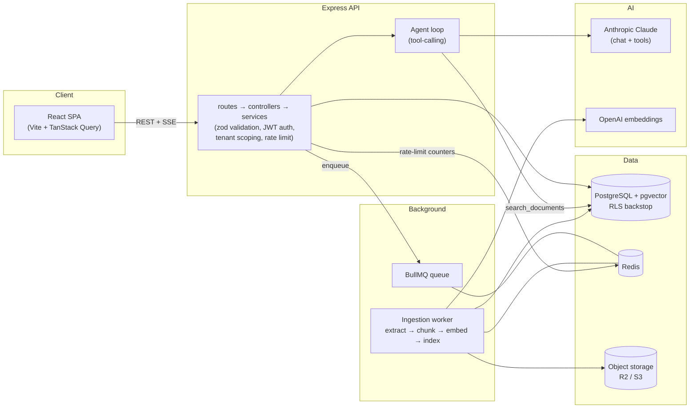

# DocPilot

**An AI Knowledge Assistant (RAG + agent) SaaS.** Teams upload documents and chat with an AI that
answers **only from those documents**, with citations — and can take actions (email a summary, create a
ticket) via LLM tool-calling. Multi-tenant, streaming, production-grade.


> Built as a portfolio project to demonstrate end-to-end AI-fullstack engineering: retrieval-augmented
> generation, an agentic tool-calling loop, background processing, and the production concerns around
> them (multi-tenancy, auth, rate limiting, cost tracking, observability, tests, CI).

---

## What it does

- **Grounded RAG chat** — ask a question, get an answer built **only** from your workspace's documents,
  with citations back to the source. Says _"I don't know based on the documents"_ rather than
  hallucinating.
- **Agentic tool-calling** — the model decides when to call tools: `search_documents` (real,
  tenant-scoped vector search), `email_summary` and `create_ticket` (mocked in the MVP). Tool activity
  is streamed and rendered inline.
- **Background ingestion** — uploads are stored, then chunked → embedded → indexed in a BullMQ worker,
  never inline in a request. The UI polls status until `READY`.
- **Streaming UX** — answers stream token-by-token over SSE with a Stop button (AbortController), plus a
  conversation history sidebar.
- **Multi-tenant & secure** — every query is scoped to a workspace and backed by Postgres Row-Level
  Security; RBAC team management; per-workspace rate limits + token/cost tracking.

---

## Architecture



**Request flows.** _Upload:_ the API stores the file → creates a `PROCESSING` document → enqueues a job →
the worker extracts/chunks/embeds and flips it to `READY`. _Chat:_ the API runs a bounded agent loop —
Claude may call `search_documents` (embed the query → tenant-scoped pgvector similarity search → grounded
context), then streams the answer + citations over SSE.

---

## Tech stack

| Layer         | Choice                                                                          |
| ------------- | ------------------------------------------------------------------------------- |
| Frontend      | React 18, Vite, TypeScript, TanStack Query, Tailwind                            |
| Backend       | Node, Express, TypeScript (feature-module structure)                            |
| Database      | PostgreSQL + pgvector (Supabase), Prisma ORM, **Row-Level Security**            |
| Jobs / cache  | Redis + BullMQ (background ingestion, rate-limit counters)                      |
| Storage       | Cloudflare R2 / S3                                                              |
| AI            | Anthropic Claude (chat + tool-calling) · OpenAI embeddings                      |
| Observability | Pino structured logs, `/api/health`, per-workspace `UsageEvent` cost tracking   |
| Tooling       | pnpm workspaces, Vitest, Prettier, GitHub Actions CI                            |

Provider access is abstracted behind swappable clients (`lib/llm`, `lib/storage`) with deterministic
**fake** drivers, so the whole app runs locally with **no API keys or cost**.

---

## Repository layout

```
docpilot/
├─ apps/
│  ├─ web/                 # React + Vite SPA
│  └─ api/                 # Express API
│     └─ src/
│        ├─ modules/       # feature modules: auth, documents, chat, agent, members, usage
│        ├─ middleware/    # auth, validation, rate-limit, errors
│        ├─ jobs/          # BullMQ worker + ingestion processor
│        ├─ lib/           # prisma, redis, llm, storage, logger, pricing
│        └─ config/        # zod-validated env
├─ packages/shared/        # TypeScript types shared front ↔ back (@docpilot/shared)
├─ docs/                   # product spec, architecture, data model, roadmap, API spec, ops
├─ docker-compose.yml      # local Redis
├─ render.yaml             # deploy blueprint (API + worker + web)
└─ DECISIONS.md            # per-phase rationale + review notes
```

---

## Local development

**Prerequisites:** Node 20+, pnpm 11, Docker (local Redis), a Postgres with pgvector (Supabase).

```bash
pnpm install

# API env — copy and fill (runs with the fake LLM/embedder and no keys for a first pass)
cp apps/api/.env.example apps/api/.env
cp apps/web/.env.example apps/web/.env   # optional in dev (Vite proxies /api)

docker compose up -d                     # local Redis (needed from Phase 2 / ingestion)
pnpm --filter api db:migrate             # apply Prisma migrations (incl. pgvector + RLS)

pnpm dev                                 # API :3000 + ingestion worker + web :5173
```

Open http://localhost:5173 → sign up → upload a PDF/DOCX/TXT → wait for `READY` → ask a question.

> For **real** answers set `LLM_PROVIDER=anthropic` + `ANTHROPIC_API_KEY`; for **semantic** retrieval set
> `EMBEDDING_PROVIDER=openai` + `OPENAI_API_KEY` (and re-upload documents). Without keys, the deterministic
> fake drivers exercise the full pipeline at no cost.

### Useful commands

```bash
pnpm dev                              # api + worker + web
pnpm typecheck                        # all packages
pnpm build                            # all packages
pnpm --filter api test                # unit tests (no external services)
pnpm --filter api test:integration    # tenant-isolation tests (needs a real Postgres)
pnpm --filter api queue:clear         # purge the ingestion queue (clears orphaned jobs)
pnpm format                           # Prettier
```

Environment variables are documented in `apps/api/.env.example` / `apps/web/.env.example` and validated
with zod at startup — the app refuses to boot if a required var is missing.

---

## Testing

- **Unit** (`pnpm --filter api test`): pricing, chunking, mime allow-list, JWT, the agent tool-loop,
  tool-arg validation, citations/escaping. No DB/Redis/LLM — runs in CI.
- **Integration** (`pnpm --filter api test:integration`): the multi-tenant **isolation** suite runs
  against a real Postgres (RLS can't be mocked) as the least-privilege role, proving workspace A cannot
  read/modify workspace B's data — the project's #1 guarantee.

---

## Security highlights

- Multi-tenancy: explicit `workspaceId` scoping on every query **plus** Postgres RLS as a backstop;
  cross-tenant access returns 404. A test proves no cross-tenant reads.
- Auth: JWT access token (in memory) + httpOnly/Secure/SameSite refresh cookie; bcrypt cost 12;
  constant-time login compare.
- Rate limiting: per-workspace (chat/upload) + per-IP (auth, brute-force) Redis counters, fail-open.
- Prompt-injection: retrieved document text is delimited + escaped and treated as data; it can't trigger
  tools. Tool arguments are zod-validated server-side; the agent loop is bounded.
- `helmet` headers, CORS locked to `WEB_ORIGIN`, secrets only in env (`.env` gitignored).

See the consolidated checklist in [`docs/08-operations.md`](docs/08-operations.md).

---

## Deployment

`render.yaml` is a [Render Blueprint](https://render.com/docs/blueprint-spec) deploying three services —
the API (web), the ingestion worker (background), and the SPA (static site) — reusing managed Supabase
(Postgres + pgvector) and Redis via env vars. Migrations run via `prisma migrate deploy` in the API's
pre-deploy step (never at app boot).

One-time / manual steps (documented inline in `render.yaml`):

1. Set the `sync:false` secrets in the Render dashboard (DB/Redis URLs, LLM + storage keys).
2. Ensure pgvector, the RLS migration, and the `docpilot_app` role exist (already true on Supabase; see
   `scripts/setup-app-role.mjs`).
3. After the first deploy, wire the two cross-references: API `WEB_ORIGIN` → the web URL, and web
   `VITE_API_BASE_URL` → the API URL.
4. Set Redis `maxmemory-policy` to `noeviction` so BullMQ jobs aren't evicted.

---

## Project docs

The `docs/` folder is the source of truth: [product spec](docs/01-project-spec.md),
[architecture](docs/02-architecture.md), [tech stack](docs/03-tech-stack.md),
[data model](docs/04-data-model.md), [roadmap](docs/05-roadmap.md), [API spec](docs/07-api-spec.md),
[operations & security](docs/08-operations.md). [`DECISIONS.md`](DECISIONS.md) records the non-obvious
choices and review-pass findings for each phase.
